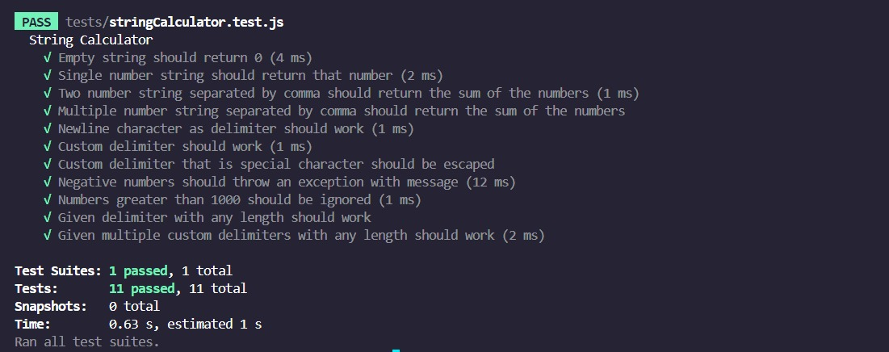
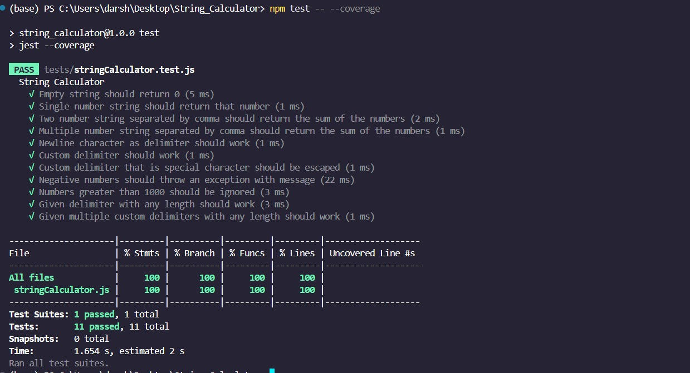

# 📐 String Calculator — Incubyte TDD Assessment

> This project was built as part of the **Incubyte recruitment assessment round** to demonstrate strong understanding and application of TDD principles.

This project is a **Test-Driven Development (TDD)** implementation of the classic String Calculator kata, completed as part of the Incubyte recruitment assessment process.

> Developed using **JavaScript** and **Jest** following strict TDD practices — Red → Green → Refactor with clean commits.

---

## ✅ Problem Statement

Implement a method:

```js
function add(numbers: string): number
```

that returns the sum of numbers in a string based on different formats and rules.

---

## 📋 Features Implemented

| ✔️ Feature                      | Description                                             |
| ------------------------------- | ------------------------------------------------------- |
| Empty Input                     | `""` → `0`                                              |
| Single Number                   | `"5"` → `5`                                             |
| Two Numbers                     | `"1,2"` → `3`                                           |
| Multiple Numbers                | `"1,2,3,4"` → `10`                                      |
| Newline as Delimiter            | `"1\n2,3"` → `6`                                        |
| Custom Delimiter                | `"//;\n1;2"` → `3`                                      |
| Special Characters as Delimiter | `"//*\n1*2"` → `3`                                      |
| Throw on Negative Numbers       | `"1,-2"` → ❌ throws `"negatives not allowed: -2"`       |
| Multiple Negatives              | `"1,-2,-4"` → ❌ throws `"negatives not allowed: -2,-4"` |
| Ignore Numbers > 1000           | `"2,1001"` → `2`                                        |
| Delimiter of Any Length         | `"//[***]\n1***2***3"` → `6`                            |
| Multiple Delimiters             | `"//[*][%]\n1*2%3"` → `6`                               |
| Multi-Char Delimiters           | `"//[***][%%]\n1***2%%3"` → `6`                         |

---

## 🚀 How to Run

### 1. Clone the repo

```bash
git clone https://github.com/ddv2311/String-Calculator-Incubyte-TDD-Assessment.git
cd String-Calculator-Incubyte-TDD-Assessment
```

### 2. Install dependencies

```bash
npm install
```

### 3. Run tests

```bash
npm test
```

> ✔️ All tests are written using Jest and located in the `/tests` directory.

---

## 🧪 Sample Output




---

## 📁 Project Structure

```
.
├── src/
│   └── stringCalculator.js
├── tests/
│   └── stringCalculator.test.js
├── screenshots/
│   └── test-output.png
├── package.json
└── README.md
```

---

## 🧠 TDD Best Practices Followed

* ✅ Red → Green → Refactor cycles
* ✅ One test at a time
* ✅ Frequent, meaningful commits
* ✅ Clean, readable, and modular code
* ✅ Helper functions for parsing and escaping

---

## 📚 Learnings and Reflections

Taking part in this assessment provided a deep dive into **Test-Driven Development (TDD)**. While implementing the String Calculator from scratch using tests first, I developed a solid appreciation for how TDD leads to clean, modular, and well-tested code.

Through this process, I also discovered the value of writing failing tests before writing production code — encouraging intentional, thought-driven design.

Exploring **TDD** also led me to explore related practices like **Behavior-Driven Development (BDD)** and how they complement each other in driving software quality and clarity. Concepts like specification by example, test readability, and collaboration between developers and stakeholders became much clearer.

This experience reinforced the importance of:

* Writing only the code needed to make tests pass
* Keeping codebase clean with frequent refactoring
* Designing features through test intent

---

## 🤝 Author

**Darshit Vyas**
[GitHub @ddv2311](https://github.com/ddv2311)

---

## 📌 Reference

This implementation is inspired by Roy Osherove's original [String Calculator Kata](https://osherove.com/tdd-kata-1).
Article reference: [An Introduction to TDD - freeCodeCamp](https://www.freecodecamp.org/news/an-introduction-to-test-driven-development-c4de6dce5c/) 